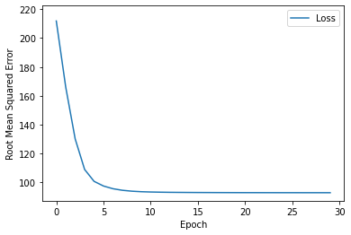

```python
import numpy as np
import pandas as pd
import tensorflow as tf
from tensorflow import feature_column
from tensorflow.keras import layers
from matplotlib import pyplot as plt

pd.options.display.max_rows = 10
pd.options.display.float_format = "{:.1f}".format

tf.keras.backend.set_floatx('float32')

print('Modules imported')
```

    Modules imported
    


```python
# Load dataset
train_df = pd.read_csv("Z:\Machine Learning\Google crash course on ML\Representaion_with_feature_cross\california_housing_train.csv")
test_df = pd.read_csv("Z:\Machine Learning\Google crash course on ML\Representaion_with_feature_cross\california_housing_test.csv")

# Scaling the labels
scale_factor = 1000.0
train_df["median_house_value"] /= scale_factor
test_df["median_house_value"] /= scale_factor

# Shuffling the examples
train_df = train_df.reindex(np.random.permutation(train_df.index))
```


```python
resolution_in_degrees = 0.4

feature_columns = []

# create a bucket feature column for latitude
latitude_as_a_numeric_column = tf.feature_column.numeric_column("latitude")
latitude_boundaries = list(np.arange(int(min(train_df['latitude'])),
                                     int(max(train_df['latitude'])),
                                     resolution_in_degrees))
latitude = tf.feature_column.bucketized_column(latitude_as_a_numeric_column,latitude_boundaries)

# create a bucket feature column for longitude
longitude_as_a_numeric_column = tf.feature_column.numeric_column("longitude")
longitude_boundaries = list(np.arange(int(min(train_df['longitude'])),
                                      int(max(train_df['longitude'])),
                                      resolution_in_degrees))
longitude = tf.feature_column.bucketized_column(longitude_as_a_numeric_column,longitude_boundaries)

# Create feature cross of latitude and longitude
latitude_x_longitude  = tf.feature_column.crossed_column([latitude, longitude], hash_bucket_size=100)
crossed_feature =tf.feature_column.indicator_column(latitude_x_longitude)
feature_columns.append(crossed_feature)

# convert this feature_columns list into layer that will become part of model
feature_cross_feature_layer = layers.DenseFeatures(feature_columns)
```


```python
#Define the create model, train model function and plot loss curve function
def create_model(my_learning_rate, feature_layer):
    model = tf.keras.models.Sequential()
    model.add(feature_layer)
    model.add(tf.keras.layers.Dense(units=1, input_shape=(1,)))
    model.compile(optimizer=tf.keras.optimizers.RMSprop(learning_rate=my_learning_rate),
                 loss="mean_squared_error",
                 metrics=[tf.keras.metrics.RootMeanSquaredError()])
    return model

def train_model(model, dataset, epochs, batch_size, label_name):
    features = {name:np.array(value) for name, value in dataset.items()}
    label = np.array(features.pop(label_name))
    history = model.fit(x=features, y=label, batch_size=batch_size,
                       epochs=epochs, shuffle=True)
    
    epochs = history.epoch
    hist = pd.DataFrame(history.history)
    rmse = hist["root_mean_squared_error"]
    return epochs, rmse

def plot_the_loss_curve(epochs, rmse):
    plt.figure()
    plt.xlabel("Epoch")
    plt.ylabel("Root Mean Squared Error")
    
    plt.plot(epochs, rmse, label="Loss")
    plt.legend()
    plt.ylim([rmse.min()*0.94, rmse.max()*1.05])
    plt.show()
```


```python
# Call the functions
# Following variables are the hyperparameteres
learning_rate = 0.1
epochs = 30
batch_size = 50
label_name = 'median_house_value'
my_model = create_model(learning_rate, feature_cross_feature_layer)

#  Train the model on the training set
epochs, rmse = train_model(my_model, train_df, epochs, batch_size, label_name)
plot_the_loss_curve(epochs,rmse)

print("Evaluate the new model against the test set")
test_features = {name:np.array(value) for name, value in test_df.items()}
test_label = np.array(test_features.pop(label_name))
my_model.evaluate(x=test_features, y=test_label, batch_size=batch_size)
```

    Epoch 1/30
    WARNING:tensorflow:Layers in a Sequential model should only have a single input tensor. Received: inputs={'longitude': <tf.Tensor 'IteratorGetNext:3' shape=(50,) dtype=float32>, 'latitude': <tf.Tensor 'IteratorGetNext:2' shape=(50,) dtype=float32>, 'housing_median_age': <tf.Tensor 'IteratorGetNext:1' shape=(50,) dtype=float32>, 'total_rooms': <tf.Tensor 'IteratorGetNext:7' shape=(50,) dtype=float32>, 'total_bedrooms': <tf.Tensor 'IteratorGetNext:6' shape=(50,) dtype=float32>, 'population': <tf.Tensor 'IteratorGetNext:5' shape=(50,) dtype=float32>, 'households': <tf.Tensor 'IteratorGetNext:0' shape=(50,) dtype=float32>, 'median_income': <tf.Tensor 'IteratorGetNext:4' shape=(50,) dtype=float32>}. Consider rewriting this model with the Functional API.
    WARNING:tensorflow:Layers in a Sequential model should only have a single input tensor. Received: inputs={'longitude': <tf.Tensor 'IteratorGetNext:3' shape=(50,) dtype=float32>, 'latitude': <tf.Tensor 'IteratorGetNext:2' shape=(50,) dtype=float32>, 'housing_median_age': <tf.Tensor 'IteratorGetNext:1' shape=(50,) dtype=float32>, 'total_rooms': <tf.Tensor 'IteratorGetNext:7' shape=(50,) dtype=float32>, 'total_bedrooms': <tf.Tensor 'IteratorGetNext:6' shape=(50,) dtype=float32>, 'population': <tf.Tensor 'IteratorGetNext:5' shape=(50,) dtype=float32>, 'households': <tf.Tensor 'IteratorGetNext:0' shape=(50,) dtype=float32>, 'median_income': <tf.Tensor 'IteratorGetNext:4' shape=(50,) dtype=float32>}. Consider rewriting this model with the Functional API.
    340/340 [==============================] - 3s 4ms/step - loss: 44865.7344 - root_mean_squared_error: 211.8153
    Epoch 2/30
    340/340 [==============================] - 1s 4ms/step - loss: 27541.5488 - root_mean_squared_error: 165.9565
    Epoch 3/30
    340/340 [==============================] - 2s 7ms/step - loss: 16919.0547 - root_mean_squared_error: 130.0733
    Epoch 4/30
    340/340 [==============================] - 2s 7ms/step - loss: 11858.6748 - root_mean_squared_error: 108.8975
    Epoch 5/30
    340/340 [==============================] - 2s 5ms/step - loss: 10135.0283 - root_mean_squared_error: 100.6729
    Epoch 6/30
    340/340 [==============================] - 2s 5ms/step - loss: 9493.1123 - root_mean_squared_error: 97.4326
    Epoch 7/30
    340/340 [==============================] - 3s 8ms/step - loss: 9131.0332 - root_mean_squared_error: 95.5564
    Epoch 8/30
    340/340 [==============================] - 3s 10ms/step - loss: 8925.2422 - root_mean_squared_error: 94.4735
    Epoch 9/30
    340/340 [==============================] - 2s 5ms/step - loss: 8807.6895 - root_mean_squared_error: 93.8493
    Epoch 10/30
    340/340 [==============================] - 1s 4ms/step - loss: 8739.8809 - root_mean_squared_error: 93.4873
    Epoch 11/30
    340/340 [==============================] - 2s 6ms/step - loss: 8702.1855 - root_mean_squared_error: 93.2855
    Epoch 12/30
    340/340 [==============================] - 3s 9ms/step - loss: 8678.3760 - root_mean_squared_error: 93.1578
    Epoch 13/30
    340/340 [==============================] - 3s 9ms/step - loss: 8661.6289 - root_mean_squared_error: 93.0679
    Epoch 14/30
    340/340 [==============================] - 2s 6ms/step - loss: 8651.7100 - root_mean_squared_error: 93.0146
    Epoch 15/30
    340/340 [==============================] - 2s 7ms/step - loss: 8643.7891 - root_mean_squared_error: 92.9720
    Epoch 16/30
    340/340 [==============================] - 2s 5ms/step - loss: 8637.2646 - root_mean_squared_error: 92.9369
    Epoch 17/30
    340/340 [==============================] - 2s 5ms/step - loss: 8633.3535 - root_mean_squared_error: 92.9158
    Epoch 18/30
    340/340 [==============================] - 3s 8ms/step - loss: 8628.9316 - root_mean_squared_error: 92.8920
    Epoch 19/30
    340/340 [==============================] - 3s 10ms/step - loss: 8625.9551 - root_mean_squared_error: 92.8760
    Epoch 20/30
    340/340 [==============================] - 3s 9ms/step - loss: 8622.9941 - root_mean_squared_error: 92.8601
    Epoch 21/30
    340/340 [==============================] - 2s 5ms/step - loss: 8620.1211 - root_mean_squared_error: 92.8446
    Epoch 22/30
    340/340 [==============================] - 2s 5ms/step - loss: 8619.6641 - root_mean_squared_error: 92.8421
    Epoch 23/30
    340/340 [==============================] - 2s 6ms/step - loss: 8617.4932 - root_mean_squared_error: 92.8305
    Epoch 24/30
    340/340 [==============================] - 1s 4ms/step - loss: 8616.6143 - root_mean_squared_error: 92.8257
    Epoch 25/30
    340/340 [==============================] - 3s 8ms/step - loss: 8615.0781 - root_mean_squared_error: 92.8174
    Epoch 26/30
    340/340 [==============================] - 3s 8ms/step - loss: 8614.7139 - root_mean_squared_error: 92.8155
    Epoch 27/30
    340/340 [==============================] - 3s 9ms/step - loss: 8613.7354 - root_mean_squared_error: 92.8102
    Epoch 28/30
    340/340 [==============================] - 3s 8ms/step - loss: 8613.3477 - root_mean_squared_error: 92.8081
    Epoch 29/30
    340/340 [==============================] - 2s 5ms/step - loss: 8612.8223 - root_mean_squared_error: 92.8053
    Epoch 30/30
    340/340 [==============================] - 1s 4ms/step - loss: 8611.2969 - root_mean_squared_error: 92.7971
    


    

    


    Evaluate the new model against the test set
    WARNING:tensorflow:Layers in a Sequential model should only have a single input tensor. Received: inputs={'longitude': <tf.Tensor 'IteratorGetNext:3' shape=(50,) dtype=float32>, 'latitude': <tf.Tensor 'IteratorGetNext:2' shape=(50,) dtype=float32>, 'housing_median_age': <tf.Tensor 'IteratorGetNext:1' shape=(50,) dtype=float32>, 'total_rooms': <tf.Tensor 'IteratorGetNext:7' shape=(50,) dtype=float32>, 'total_bedrooms': <tf.Tensor 'IteratorGetNext:6' shape=(50,) dtype=float32>, 'population': <tf.Tensor 'IteratorGetNext:5' shape=(50,) dtype=float32>, 'households': <tf.Tensor 'IteratorGetNext:0' shape=(50,) dtype=float32>, 'median_income': <tf.Tensor 'IteratorGetNext:4' shape=(50,) dtype=float32>}. Consider rewriting this model with the Functional API.
    60/60 [==============================] - 1s 5ms/step - loss: 8559.5957 - root_mean_squared_error: 92.5181
    


    [8559.595703125, 92.51808166503906]


```python

```


```python

```
