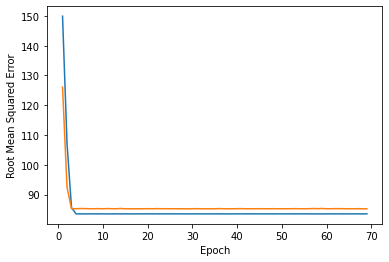

```python
import pandas as pd
import numpy as np
import tensorflow as tf
from matplotlib import pyplot as plt

pd.options.display.max_rows = 10
pd.options.display.float_format = "{:.1f}".format
```


```python
# Load Dataset
train_df = pd.read_csv("Z:\Machine Learning\Google crash course on ML\Validation and Test Sets\california_housing_train.csv")
test_df = pd.read_csv("Z:\Machine Learning\Google crash course on ML\Validation and Test Sets\california_housing_test.csv")
```


```python
# Scale the label values
scale_factor = 1000.0

train_df.median_house_value /= scale_factor
test_df.median_house_value /= scale_factor
```


```python
# Build and train the model
def build_model(my_learning_rate):
    model = tf.keras.models.Sequential()
    model.add(tf.keras.layers.Dense(units=1, input_shape=(1,)))
    model.compile(optimizer=tf.keras.optimizers.RMSprop(learning_rate=my_learning_rate),
                 loss="mean_squared_error",
                 metrics=[tf.keras.metrics.RootMeanSquaredError()])
    
    return model

def train_model(model, df, feature, label, my_epochs,
               my_batch_size=None, my_validation_split=0.1):
    """Feed dataset into the model to train it"""
    history = model.fit(x = df[feature],
                        y = df[label],
                        batch_size = my_batch_size,
                        epochs = my_epochs,
                        validation_split = my_validation_split)
    
    trained_weight = model.get_weights()[0]
    trained_bias = model.get_weights()[1]
    
    epochs = history.epoch
    
    hist = pd.DataFrame(history.history)
    rmse = hist["root_mean_squared_error"]
    
    return epochs, rmse, history.history

print("build_model() and train_model() defined")
```

    build_model() and train_model() defined
    


```python
# Plot the loss curve
def plot_the_loss_curve(epochs, mae_training, mae_validation):
    """Plot the loss vs epoch curve"""
    plt.figure()
    plt.xlabel("Epoch")
    plt.ylabel("Root Mean Squared Error")
    
    plt.plot(epochs[1:], mae_training[1:], label="Training Loss")
    plt.plot(epochs[1:], mae_validation[1:], label="Validation Loss")
    
    merged_mae_lists = mae_training[1:] + mae_validation[1:]
    highest_loss = max(merged_mae_lists)
    lowest_loss = min(merged_mae_lists)
    delta = highest_loss - lowest_loss
    print(delta)

    top_of_y_axis = highest_loss + (delta * 0.05)
    bottom_of_y_axis = lowest_loss - (delta * 0.05)
    
    plt.ylim([bottom_of_y_axis, top_of_y_axis])
    plt.show()  

print("plot_the_loss_curve function defined")
```

    plot_the_loss_curve function defined
    


```python
# Calling the functions
learning_rate = 0.08
epochs = 70
batch_size = 100

validation_split = 0.15

my_feature = "median_income"
my_label = "median_house_value"

# Discard any pre-existing version of the model
my_model = None

# Shuffle the data
shuffled_train_df = train_df.reindex(np.random.permutation(train_df.index))

my_model = build_model(learning_rate)
epochs, rmse, history = train_model(my_model, shuffled_train_df, my_feature,
                                    my_label, epochs, batch_size,
                                    validation_split)

plot_the_loss_curve(epochs, history["root_mean_squared_error"],
                    history["val_root_mean_squared_error"])


```

    Epoch 1/70
    145/145 [==============================] - 1s 3ms/step - loss: 40566.3516 - root_mean_squared_error: 201.4109 - val_loss: 30375.8438 - val_root_mean_squared_error: 174.2867
    Epoch 2/70
    145/145 [==============================] - 0s 2ms/step - loss: 22469.8594 - root_mean_squared_error: 149.8995 - val_loss: 15896.3936 - val_root_mean_squared_error: 126.0809
    Epoch 3/70
    145/145 [==============================] - 0s 2ms/step - loss: 11484.6758 - root_mean_squared_error: 107.1666 - val_loss: 8543.6689 - val_root_mean_squared_error: 92.4320
    Epoch 4/70
    145/145 [==============================] - 0s 3ms/step - loss: 7333.3081 - root_mean_squared_error: 85.6347 - val_loss: 7263.0566 - val_root_mean_squared_error: 85.2236
    Epoch 5/70
    145/145 [==============================] - 0s 3ms/step - loss: 6972.6450 - root_mean_squared_error: 83.5024 - val_loss: 7264.3403 - val_root_mean_squared_error: 85.2311
    Epoch 6/70
    145/145 [==============================] - 0s 2ms/step - loss: 6971.2690 - root_mean_squared_error: 83.4941 - val_loss: 7273.4009 - val_root_mean_squared_error: 85.2842
    Epoch 7/70
    145/145 [==============================] - 0s 3ms/step - loss: 6970.5801 - root_mean_squared_error: 83.4900 - val_loss: 7272.7817 - val_root_mean_squared_error: 85.2806
    Epoch 8/70
    145/145 [==============================] - 0s 2ms/step - loss: 6970.3257 - root_mean_squared_error: 83.4885 - val_loss: 7261.6426 - val_root_mean_squared_error: 85.2153
    Epoch 9/70
    145/145 [==============================] - 0s 2ms/step - loss: 6971.0776 - root_mean_squared_error: 83.4930 - val_loss: 7262.2759 - val_root_mean_squared_error: 85.2190
    Epoch 10/70
    145/145 [==============================] - 0s 3ms/step - loss: 6969.8779 - root_mean_squared_error: 83.4858 - val_loss: 7268.5474 - val_root_mean_squared_error: 85.2558
    Epoch 11/70
    145/145 [==============================] - 0s 2ms/step - loss: 6971.5410 - root_mean_squared_error: 83.4958 - val_loss: 7259.7217 - val_root_mean_squared_error: 85.2040
    Epoch 12/70
    145/145 [==============================] - 0s 2ms/step - loss: 6969.5479 - root_mean_squared_error: 83.4838 - val_loss: 7271.8550 - val_root_mean_squared_error: 85.2752
    Epoch 13/70
    145/145 [==============================] - 0s 3ms/step - loss: 6969.0449 - root_mean_squared_error: 83.4808 - val_loss: 7262.0493 - val_root_mean_squared_error: 85.2177
    Epoch 14/70
    145/145 [==============================] - 0s 2ms/step - loss: 6971.0410 - root_mean_squared_error: 83.4928 - val_loss: 7260.3271 - val_root_mean_squared_error: 85.2076
    Epoch 15/70
    145/145 [==============================] - 0s 2ms/step - loss: 6969.5420 - root_mean_squared_error: 83.4838 - val_loss: 7277.8940 - val_root_mean_squared_error: 85.3106
    Epoch 16/70
    145/145 [==============================] - 0s 2ms/step - loss: 6972.2803 - root_mean_squared_error: 83.5002 - val_loss: 7259.6157 - val_root_mean_squared_error: 85.2034
    Epoch 17/70
    145/145 [==============================] - 0s 2ms/step - loss: 6970.6777 - root_mean_squared_error: 83.4906 - val_loss: 7261.7622 - val_root_mean_squared_error: 85.2160
    Epoch 18/70
    145/145 [==============================] - 0s 2ms/step - loss: 6971.0483 - root_mean_squared_error: 83.4928 - val_loss: 7260.1450 - val_root_mean_squared_error: 85.2065
    Epoch 19/70
    145/145 [==============================] - 0s 2ms/step - loss: 6971.3047 - root_mean_squared_error: 83.4943 - val_loss: 7262.2617 - val_root_mean_squared_error: 85.2189
    Epoch 20/70
    145/145 [==============================] - 1s 4ms/step - loss: 6971.7666 - root_mean_squared_error: 83.4971 - val_loss: 7260.2563 - val_root_mean_squared_error: 85.2071
    Epoch 21/70
    145/145 [==============================] - 0s 2ms/step - loss: 6971.7119 - root_mean_squared_error: 83.4968 - val_loss: 7266.0908 - val_root_mean_squared_error: 85.2414
    Epoch 22/70
    145/145 [==============================] - 0s 2ms/step - loss: 6971.5190 - root_mean_squared_error: 83.4956 - val_loss: 7259.7749 - val_root_mean_squared_error: 85.2043
    Epoch 23/70
    145/145 [==============================] - 0s 2ms/step - loss: 6970.2432 - root_mean_squared_error: 83.4880 - val_loss: 7268.6597 - val_root_mean_squared_error: 85.2564
    Epoch 24/70
    145/145 [==============================] - 0s 2ms/step - loss: 6970.8145 - root_mean_squared_error: 83.4914 - val_loss: 7264.0327 - val_root_mean_squared_error: 85.2293
    Epoch 25/70
    145/145 [==============================] - 0s 2ms/step - loss: 6971.7202 - root_mean_squared_error: 83.4968 - val_loss: 7263.1567 - val_root_mean_squared_error: 85.2242
    Epoch 26/70
    145/145 [==============================] - 0s 2ms/step - loss: 6970.4873 - root_mean_squared_error: 83.4894 - val_loss: 7260.2676 - val_root_mean_squared_error: 85.2072
    Epoch 27/70
    145/145 [==============================] - 0s 2ms/step - loss: 6971.9351 - root_mean_squared_error: 83.4981 - val_loss: 7263.5371 - val_root_mean_squared_error: 85.2264
    Epoch 28/70
    145/145 [==============================] - 0s 2ms/step - loss: 6971.0786 - root_mean_squared_error: 83.4930 - val_loss: 7263.0464 - val_root_mean_squared_error: 85.2235
    Epoch 29/70
    145/145 [==============================] - 0s 2ms/step - loss: 6970.7354 - root_mean_squared_error: 83.4909 - val_loss: 7259.8335 - val_root_mean_squared_error: 85.2047
    Epoch 30/70
    145/145 [==============================] - 0s 2ms/step - loss: 6971.4800 - root_mean_squared_error: 83.4954 - val_loss: 7259.5469 - val_root_mean_squared_error: 85.2030
    Epoch 31/70
    145/145 [==============================] - 0s 2ms/step - loss: 6970.5659 - root_mean_squared_error: 83.4899 - val_loss: 7260.5513 - val_root_mean_squared_error: 85.2089
    Epoch 32/70
    145/145 [==============================] - 0s 2ms/step - loss: 6971.3477 - root_mean_squared_error: 83.4946 - val_loss: 7267.1582 - val_root_mean_squared_error: 85.2476
    Epoch 33/70
    145/145 [==============================] - 0s 2ms/step - loss: 6971.5981 - root_mean_squared_error: 83.4961 - val_loss: 7260.7954 - val_root_mean_squared_error: 85.2103
    Epoch 34/70
    145/145 [==============================] - 0s 2ms/step - loss: 6971.4385 - root_mean_squared_error: 83.4951 - val_loss: 7259.6392 - val_root_mean_squared_error: 85.2035
    Epoch 35/70
    145/145 [==============================] - 0s 2ms/step - loss: 6971.4526 - root_mean_squared_error: 83.4952 - val_loss: 7259.9507 - val_root_mean_squared_error: 85.2053
    Epoch 36/70
    145/145 [==============================] - 0s 2ms/step - loss: 6970.5220 - root_mean_squared_error: 83.4897 - val_loss: 7259.5405 - val_root_mean_squared_error: 85.2029
    Epoch 37/70
    145/145 [==============================] - 0s 3ms/step - loss: 6971.4014 - root_mean_squared_error: 83.4949 - val_loss: 7271.0361 - val_root_mean_squared_error: 85.2704
    Epoch 38/70
    145/145 [==============================] - 0s 2ms/step - loss: 6970.5371 - root_mean_squared_error: 83.4897 - val_loss: 7261.2017 - val_root_mean_squared_error: 85.2127
    Epoch 39/70
    145/145 [==============================] - 0s 3ms/step - loss: 6969.0557 - root_mean_squared_error: 83.4809 - val_loss: 7260.8472 - val_root_mean_squared_error: 85.2106
    Epoch 40/70
    145/145 [==============================] - 0s 2ms/step - loss: 6970.1030 - root_mean_squared_error: 83.4871 - val_loss: 7260.2534 - val_root_mean_squared_error: 85.2071
    Epoch 41/70
    145/145 [==============================] - 0s 2ms/step - loss: 6971.8691 - root_mean_squared_error: 83.4977 - val_loss: 7265.9756 - val_root_mean_squared_error: 85.2407
    Epoch 42/70
    145/145 [==============================] - 0s 3ms/step - loss: 6971.5752 - root_mean_squared_error: 83.4960 - val_loss: 7269.1333 - val_root_mean_squared_error: 85.2592
    Epoch 43/70
    145/145 [==============================] - 0s 2ms/step - loss: 6971.4092 - root_mean_squared_error: 83.4950 - val_loss: 7260.5293 - val_root_mean_squared_error: 85.2087
    Epoch 44/70
    145/145 [==============================] - 0s 2ms/step - loss: 6971.3843 - root_mean_squared_error: 83.4948 - val_loss: 7263.6689 - val_root_mean_squared_error: 85.2272
    Epoch 45/70
    145/145 [==============================] - 0s 3ms/step - loss: 6971.1182 - root_mean_squared_error: 83.4932 - val_loss: 7259.6401 - val_root_mean_squared_error: 85.2035
    Epoch 46/70
    145/145 [==============================] - 0s 2ms/step - loss: 6971.0586 - root_mean_squared_error: 83.4929 - val_loss: 7264.0532 - val_root_mean_squared_error: 85.2294
    Epoch 47/70
    145/145 [==============================] - 0s 2ms/step - loss: 6971.6973 - root_mean_squared_error: 83.4967 - val_loss: 7263.9263 - val_root_mean_squared_error: 85.2287
    Epoch 48/70
    145/145 [==============================] - 0s 2ms/step - loss: 6970.2227 - root_mean_squared_error: 83.4879 - val_loss: 7259.7959 - val_root_mean_squared_error: 85.2044
    Epoch 49/70
    145/145 [==============================] - 0s 2ms/step - loss: 6971.3833 - root_mean_squared_error: 83.4948 - val_loss: 7265.8384 - val_root_mean_squared_error: 85.2399
    Epoch 50/70
    145/145 [==============================] - 0s 2ms/step - loss: 6970.1011 - root_mean_squared_error: 83.4871 - val_loss: 7259.8579 - val_root_mean_squared_error: 85.2048
    Epoch 51/70
    145/145 [==============================] - 0s 2ms/step - loss: 6972.0645 - root_mean_squared_error: 83.4989 - val_loss: 7263.1836 - val_root_mean_squared_error: 85.2243
    Epoch 52/70
    145/145 [==============================] - 0s 3ms/step - loss: 6969.9136 - root_mean_squared_error: 83.4860 - val_loss: 7261.0918 - val_root_mean_squared_error: 85.2120
    Epoch 53/70
    145/145 [==============================] - 0s 2ms/step - loss: 6971.6323 - root_mean_squared_error: 83.4963 - val_loss: 7263.5850 - val_root_mean_squared_error: 85.2267
    Epoch 54/70
    145/145 [==============================] - 0s 2ms/step - loss: 6970.3325 - root_mean_squared_error: 83.4885 - val_loss: 7266.5947 - val_root_mean_squared_error: 85.2443
    Epoch 55/70
    145/145 [==============================] - 0s 2ms/step - loss: 6971.8213 - root_mean_squared_error: 83.4974 - val_loss: 7262.4893 - val_root_mean_squared_error: 85.2202
    Epoch 56/70
    145/145 [==============================] - 0s 2ms/step - loss: 6971.2305 - root_mean_squared_error: 83.4939 - val_loss: 7259.6299 - val_root_mean_squared_error: 85.2035
    Epoch 57/70
    145/145 [==============================] - 0s 2ms/step - loss: 6971.2559 - root_mean_squared_error: 83.4940 - val_loss: 7264.6870 - val_root_mean_squared_error: 85.2331
    Epoch 58/70
    145/145 [==============================] - 0s 2ms/step - loss: 6969.3452 - root_mean_squared_error: 83.4826 - val_loss: 7274.7153 - val_root_mean_squared_error: 85.2919
    Epoch 59/70
    145/145 [==============================] - 0s 2ms/step - loss: 6971.0454 - root_mean_squared_error: 83.4928 - val_loss: 7265.5088 - val_root_mean_squared_error: 85.2380
    Epoch 60/70
    145/145 [==============================] - 0s 2ms/step - loss: 6970.7705 - root_mean_squared_error: 83.4911 - val_loss: 7277.8730 - val_root_mean_squared_error: 85.3104
    Epoch 61/70
    145/145 [==============================] - 0s 2ms/step - loss: 6971.1650 - root_mean_squared_error: 83.4935 - val_loss: 7260.3774 - val_root_mean_squared_error: 85.2078
    Epoch 62/70
    145/145 [==============================] - 0s 2ms/step - loss: 6971.5684 - root_mean_squared_error: 83.4959 - val_loss: 7263.3364 - val_root_mean_squared_error: 85.2252
    Epoch 63/70
    145/145 [==============================] - 0s 2ms/step - loss: 6969.9321 - root_mean_squared_error: 83.4861 - val_loss: 7269.1206 - val_root_mean_squared_error: 85.2591
    Epoch 64/70
    145/145 [==============================] - 0s 2ms/step - loss: 6971.0459 - root_mean_squared_error: 83.4928 - val_loss: 7266.4233 - val_root_mean_squared_error: 85.2433
    Epoch 65/70
    145/145 [==============================] - 0s 3ms/step - loss: 6971.4219 - root_mean_squared_error: 83.4950 - val_loss: 7264.2598 - val_root_mean_squared_error: 85.2306
    Epoch 66/70
    145/145 [==============================] - 0s 2ms/step - loss: 6969.7119 - root_mean_squared_error: 83.4848 - val_loss: 7260.8457 - val_root_mean_squared_error: 85.2106
    Epoch 67/70
    145/145 [==============================] - 0s 2ms/step - loss: 6971.3706 - root_mean_squared_error: 83.4947 - val_loss: 7260.0298 - val_root_mean_squared_error: 85.2058
    Epoch 68/70
    145/145 [==============================] - 0s 2ms/step - loss: 6970.8198 - root_mean_squared_error: 83.4914 - val_loss: 7266.1138 - val_root_mean_squared_error: 85.2415
    Epoch 69/70
    145/145 [==============================] - 0s 3ms/step - loss: 6969.7632 - root_mean_squared_error: 83.4851 - val_loss: 7259.6104 - val_root_mean_squared_error: 85.2033
    Epoch 70/70
    145/145 [==============================] - 0s 2ms/step - loss: 6971.8130 - root_mean_squared_error: 83.4974 - val_loss: 7260.8447 - val_root_mean_squared_error: 85.2106
    66.41868591308594
    


    

    


```python
# Use the Test Dataset to Evaluate Model's Performance
x_test = test_df[my_feature]
y_test = test_df[my_label]

results = my_model.evaluate(x_test, y_test, batch_size=batch_size)
```

    30/30 [==============================] - 0s 3ms/step - loss: 7010.9380 - root_mean_squared_error: 83.7313
    
